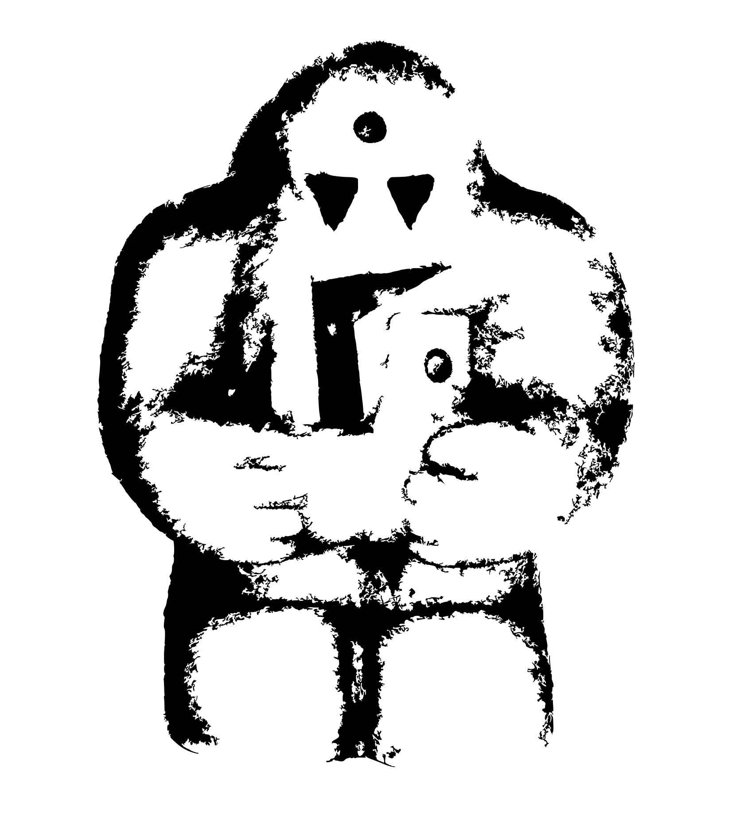

<p align="center">
  
  <h3 align="center">Golem</h3>

  <p align="center">"Scrap Your Boilerplate" for Go</p>
  <blockquote><p>
    His dust was "kneaded into a shapeless husk."
  </p></blockquote>
  <blockquote><p>
    You could do this with a macro, but... the best macro is a macro you don't maintain.
  </p></blockquote>
</p>

[](http://godoc.org/github.com/fogfish/golem)
[](http://travis-ci.org/fogfish/golem)
[](http://travis-ci.org/fogfish/golem)
[](https://coveralls.io/github/fogfish/golem?branch=master)
[](https://goreportcard.com/report/github.com/fogfish/golem)

---

# Golem: "Scrap Your Boilerplate" for Go


> His dust was "kneaded into a shapeless husk."

> You could do this with a macro, but...
> the best macro is a macro you don't maintain


**golem** is a pure functional and generic programming for Go. It had its origins in [Purely Functional Data Structures](https://www.cs.cmu.edu/~rwh/theses/okasaki.pdf) by Chris Okasaki, on implementing a various higher rank functional abstractions and patterns, on dealing with [scrap your boilerplate](https://www.microsoft.com/en-us/research/publication/scrap-your-boilerplate-with-class/) and gaining experience from other functional languages primary Scala, Haskell and heavily inspired by Erlang twin library [datum](https://github.com/fogfish/datum). Golem is testing the limits of functional abstractions in Go.


## Inspiration

[Functional Programming](https://en.wikipedia.org/wiki/Functional_programming) is a declarative style of development that uses side-effect free functions to express solution of the problem domain. The [core concepts](http://www.se-radio.net/2007/07/episode-62-martin-odersky-on-scala/) of functional programming are elaborated by Martin Odersky - First class and high-order **functions** and **immutability**. Another  key feature in functional programming is the **composition** - a style of development to build a new things from small reusable elements. Functional code looks great only if functions clearly describe your problem. Usually lines of code per function is only a single metric that reflects [quality of the code](https://blog.usejournal.com/solving-embarrassingly-obvious-problems-in-erlang-e3f21a6203cc)

> If your functions have more than a few lines of code (a maximum of four to five lines per function is a good benchmark), you need to look more closely — chances are you have an opportunity to factor them into smaller, more tightly focused functions

This is because functions describe the solution to your problem. If your code contains many lines then highly likely you are solving few problems without articulating them. A critical thinking is the process of software development - [Write small blocks of code](https://blog.ploeh.dk/2019/11/04/the-80-24-rule/).

Functional style programming can be achieved in any language, including Go. Golang's [structural type system](https://en.wikipedia.org/wiki/Structural_type_system) helps to reject invalid programs at compilation time. One of the challenge here, Go's structures, arrays, slices and maps embrace mutability rather than restricting it. Scala is a good example of the language that uses imperative runtime but provide data structure implementations that internally prevent mutation. This is a perfect approach to achieve immutability and performance through well-defined scopes. All-in-all, Go is a general purpose language with simple building blocks. This library uses these blocks to implement a functional style of development with the goal of simplicity in mind.

## Key features

* [Generic](generic) with build time code generation.
* [Monoid](doc/monoid.md) for structural transformation.
* [Seq](https://godoc.org/github.com/fogfish/golem/seq) is a special case for slice that support convenient methods. 


## Getting started

The latest version of the library is available at `master` branch. All development, including new features and bug fixes, take place on the `master` branch using forking and pull requests as described in contribution guidelines.

Usage of library requires **installation** of command line utility, see it [documentation](https://godoc.org/github.com/fogfish/golem/cmd/golem) and [workflows](doc/generic.md)

```bash
go get -u github.com/fogfish/golem/cmd/golem
```

**Import** the library packages in your code

```go
import (
  "github.com/fogfish/golem/..."
)
```

**Parametrize** generic templates with

```go
//go:generate golem -T FooBar -generic github.com/fogfish/golem/seq/seq.go
```

See the [documentation](http://godoc.org/github.com/fogfish/golem)


## How To Contribute

The library is [MIT](LICENSE) licensed and accepts contributions via GitHub pull requests:

1. Fork it
2. Create your feature branch (`git checkout -b my-new-feature`)
3. Commit your changes (`git commit -am 'Added some feature'`)
4. Push to the branch (`git push origin my-new-feature`)
5. Create new Pull Request


The build and testing process requires [Go](https://golang.org) version 1.13 or later.

**Build** and **run** in your development console.

```bash
git clone https://github.com/fogfish/golem
cd golem
go test -cover ./...
```

## License

[](LICENSE)
