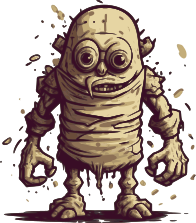

<p align="center">
  
  <h3 align="center">Golem</h3>
  <p align="center"><strong>"Scrap Your Boilerplate" for Go</strong></p>

  <p align="center">
    <!-- Build Status  -->
    <a href="https://github.com/fogfish/golem/actions/">
      
    </a>
    <!-- GitHub -->
    <a href="http://github.com/fogfish/golem">
      
    </a>
    <!-- Coverage -->
    <a href="https://coveralls.io/github/fogfish/golem?branch=main">
      
    </a>
    <!-- Go Card -->
    <a href="https://goreportcard.com/report/github.com/fogfish/golem">
      
    </a>
  </p>
  <table align="center">
    <thead><tr><th>sub-module</th><th>doc</th><th>about</th></tr></thead>
    <tbody>
    <!-- Module hseq -->
    <tr><td><a href="./hseq/">
      
    </a></td>
    <td><a href="https://pkg.go.dev/github.com/fogfish/golem/hseq">
      
    </a></td>
    <td>
    Heterogenous sequence of types
    </td></tr>
    <!-- Module optics -->
    <tr><td><a href="./optics/">
      
    </a></td>
    <td><a href="https://pkg.go.dev/github.com/fogfish/golem/optics">
      
    </a></td>
    <td>
    Composable getters and setters (lenses) for manipulating data structures 
    </td></tr>
    <!-- Module pipe -->
    <tr><td><a href="./pipe/">
      
    </a></td>
    <td><a href="https://pkg.go.dev/github.com/fogfish/golem/pipe">
      
    </a></td>
    <td>
    Type safe channels and data pipeline combinator.
    </td></tr>
    <!-- Module pure -->
    <tr><td><a href="./pure/">
      
    </a></td>
    <td><a href="https://pkg.go.dev/github.com/fogfish/golem/pure">
      
    </a></td>
    <td>
    Generic purely functional abstractions (e.g. HKT, Monoid, etc).
    </td></tr>
    <!-- Module trait -->
    <tr><td><a href="./trait/">
      
    </a></td>
    <td><a href="https://pkg.go.dev/github.com/fogfish/golem/trait">
      
    </a></td>
    <td>
    Generic behavior traits.
    </td></tr>
    </tbody>
  </table>
</p>

--- 

> His dust was "kneaded into a shapeless husk."

> You could do this with a macro, but...
> the best macro is a macro you don't maintain

**Golem** is a purely functional and generic programming library for Go. It has its origins in [Purely Functional Data Structures](./doc/okasaki.pdf) by Chris Okasaki, and implements various functional abstractions and patterns, deals with [scrap your boilerplate](https://www.microsoft.com/en-us/research/publication/scrap-your-boilerplate-with-class/) and benefits from the experience of other functional languages, primary Scala, Haskell and also heavily inspired by the Erlang library [datum](https://github.com/fogfish/datum). Golem is testing the limits of functional abstractions in Go.


## Inspiration

[Functional Programming](https://en.wikipedia.org/wiki/Functional_programming) is a declarative style of development that uses side effect free functions to express the solution of the problem domain. The [core concepts](http://www.se-radio.net/2007/07/episode-62-martin-odersky-on-scala/) of functional programming are elaborated by Martin Odersky - First class and high-order **functions** and **immutability**. Another  key feature in functional programming is the **composition** - a style of development to build new things from small reusable elements. Functional code looks great only if functions clearly describe your problem. Usually, lines of code per function is only a single metric that reflects the [quality of the code](https://blog.usejournal.com/solving-embarrassingly-obvious-problems-in-erlang-e3f21a6203cc)

> If your functions have more than a few lines of code (a maximum of four to five lines per function is a good benchmark), you need to look more closely — chances are you have an opportunity to factor them into smaller, more tightly focused functions

This is because functions describe the solution to your problem. If your code contains many lines, then it is highly likely, that you are solving few problems without explicitly articulating them. And critical thinking is the process of software development - [Write small blocks of code](https://blog.ploeh.dk/2019/11/04/the-80-24-rule/).

Functional style programming can be achieved in any language, including Go. Golang's [structural type system](https://en.wikipedia.org/wiki/Structural_type_system) helps to reject invalid programs at compilation time. One of the challenge here is, that Go's structures, arrays, slices and maps embrace mutability rather than restricting it. Scala is a good example of the language that uses an imperative runtime but provides data structure implementations that inherently avoid mutation. This is a perfect approach to achieve immutability and performance through well-defined scopes. All-in-all, Go is a general purpose language with simple building blocks. This library uses these blocks to implement a functional style of development with the goal of simplicity in mind.


## Getting started

The library requires **Go 1.18** or  later due to usage of [generics](https://go.dev/blog/intro-generics).

The latest version of the library is available at `main` branch. All development, including new features and bug fixes, take place on the `main` branch using forking and pull requests as described in contribution guidelines. The stable version is available via Golang modules. 

1. Use `go get` to retrieve the library and add it as a dependency to your application.

```bash
go get -u github.com/fogfish/golem/{submodule}
```

2. Import required package in your code

```go
import (
  "github.com/fogfish/golem/{submodule}"
)
```

## Examples and show cases 
* [Type classes](doc/typeclass.md)
* [Higher-kinded polymorphism](doc/higher-kinded-polymorphism.md)
* [A Guide To Higher-Kinded Type Classes with Golang](https://towardsdev.com/a-guide-to-higher-kinded-type-classes-with-golang-36dab6c9ecc4)
* [Why higher-kinded polymorphism is vital functional abstraction and How to implement type classes with Golang](https://medium.com/@dmkolesnikov/why-higher-kinded-polymorphism-is-vital-functional-abstraction-and-how-to-implement-type-classes-b30ee0576dd5)
* [Type combinators](doc/combinator.md) deliver powerful patterns for functional programming.
* [A Guide To Pure Type Combinators in Golang or How to Stop Worrying and Love the Functional Programming](https://medium.com/@dmkolesnikov/a-guide-to-pure-type-combinators-in-golang-or-how-to-stop-worrying-and-love-the-functional-e14f7f8cf35c)
* [Monoid](doc/monoid.md) for structural transformation.
* [Abstract over Golang structure fields using optics](doc/abstract-over-struct-fields-using-optics.md)
* [Heterogenous Sequence of Types](/hseq/)
* [Golang Optics](/optics/)


## How To Contribute

The library is [MIT](LICENSE) licensed and accepts contributions via GitHub pull requests:

1. Fork it
2. Create your feature branch (`git checkout -b my-new-feature`)
3. Commit your changes (`git commit -am 'Added some feature'`)
4. Push to the branch (`git push origin my-new-feature`)
5. Create new Pull Request


The build and testing process requires [Go](https://golang.org) version 1.13 or later.

**Build** and **run** in your development console.

```bash
git clone https://github.com/fogfish/golem
cd golem
go test -cover ./...
```

## License

[](LICENSE)

<!--

https://writings.stephenwolfram.com/2020/12/combinators-and-the-story-of-computation/
https://files.wolframcdn.com/pub/www.wolframscience.com/nks/nks-ch12.pdf
https://www.wolframscience.com/nks/

https://cmc.gitbook.io/go-internals/chapter-ii-interfaces
https://www.cockroachlabs.com/blog/how-we-built-a-vectorized-execution-engine/
http://citeseerx.ist.psu.edu/viewdoc/download;jsessionid=B3EBE6337709E0E494DB7074FC4D247A?doi=10.1.1.17.524&rep=rep1&type=pdf
https://www.cs.cmu.edu/~ckingsf/bioinfo-lectures/skiplists.pdf
https://github.com/avelino/awesome-go#networking


Research on the interface of Golang
https://laptrinhx.com/research-on-the-interface-of-golang-4184713904/


Category Theory 10.1: Monads
https://www.youtube.com/watch?v=gHiyzctYqZ0&list=PLbgaMIhjbmEnaH_LTkxLI7FMa2HsnawM_&index=21&t=4s

TypeScript on steroids
https://dev.to/gcanti/getting-started-with-fp-ts-setoid-39f3
https://dev.to/gcanti/functional-design-combinators-14pn
https://dev.to/gcanti/getting-started-with-fp-ts-setoid-39f3
https://dev.to/gcanti/functional-design-combinators-14pn

Scala Cats
https://typelevel.org/cats/typeclasses.html
https://typelevel.org/cats/typeclasses/monoid.html
https://typelevel.org/cats/typeclasses/semigroup.html

HTK
https://github.com/ocamllabs/higher
https://bow-swift.io/docs/fp-concepts/higher-kinded-types/
https://github.com/gcanti/fp-ts/blob/master/src/Eq.ts


https://go101.org/article/details.html
https://github.com/emirpasic/gods
-->
