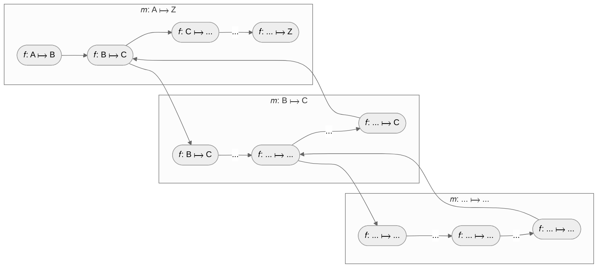

# Metaprogramming of computations (`duct`)

The `duct` module provides a **composition pattern** for declaring **monadic computation** using abstract morphisms. It offers a **category-theory-inspired algebra** that enables structured composition of transformations (`ƒ: A ⟼ B`), forming **composable computation pipelines** (`𝑚: A ⟼ B`). Instead of executing computations directly, `duct` constructs an **abstract syntax tree (AST)** that represents the computation **declaratively**.



This approach is particularly useful for **metaprogramming**, where the **separation of concerns** is crucial. By modeling computation as a structured transformation pipeline, `duct` allows **introspection, optimization, and transformation** before execution. This makes it especially powerful in domains like **query builders, code generation and infrastructure as a code**, where the representation of computation is as important as the computation itself.

With `duct`, computations are **first-class entities**, enabling dynamic modification, analysis, and execution strategies that extend beyond traditional function composition.


- [Metaprogramming of computations (`duct`)](#metaprogramming-of-computations-duct)
  - [Quick Example](#quick-example)
  - [Algebra](#algebra)
    - [𝑚: A ⟼ B](#𝑚-a--b)
    - [From(A) = idᴬ : 𝑰 ⟼ A](#froma--idᴬ--𝑰--a)
    - [Join(𝑓, 𝑚) = 𝑓 ∘ 𝑚 : A ⟼ C](#join𝑓-𝑚--𝑓--𝑚--a--c)
    - [LiftF(𝑓, 𝑚) = 𝓕(𝑓) ∘ 𝑚 : A ⟼ 𝓕⁺(C)](#liftf𝑓-𝑚--𝓕𝑓--𝑚--a--𝓕c)
    - [WrapF(𝑚) = LiftF(idᴬ, 𝑚) : A ⟼ 𝓕⁺(B)](#wrapf𝑚--liftfidᴬ-𝑚--a--𝓕b)
    - [Unit(𝑚) = 𝜂 ∘ 𝑚⁺ : 𝓕⁺(A) ⟼ 𝓕(B)](#unit𝑚--𝜂--𝑚--𝓕a--𝓕b)
    - [Yield(𝑚) = ⟘ᴮ ∘ 𝑚 : B ⟼ 𝑻](#yield𝑚--ᴮ--𝑚--b--𝑻)
    - [Examples](#examples)
  - [How To Contribute](#how-to-contribute)
  - [License](#license)


## Quick Example

Assuming initial and terminal objects `⟨𝑰,𝑻⟩`. The initial object `𝑰` has exactly one identity morphism `𝑰 ⟼ A`, can be thought of as the starting point in the system. Consequntly, the terminal object `𝑻` has morphism `B ⟼ 𝑻`, can be thought of as the end point in the system. 

```
𝑚: 𝑰 ⟼ 𝑻
  𝑓: 𝑰 ⟼ A
  𝑓: A ⟼ B
  𝑓: B ⟼ 𝑻
```

Therefor, the morphism `𝑚: 𝑰 ⟼ 𝑻` is defined using duct's algebra.

```go
f := duct.Yield(
  duct.L1[string](/* target */),
  duct.Join(
    duct.L2[int, string](/* computation */),
    duct.From(
      duct.L1[int](/* source */),
    ),
  ),
)
```

Given notation has defined a system capable of sourcing `int`, transforming them to `strings` and emitting results. By itself this naive example defines clear **separation of concerns** approach--defining the data flow but abstracting away the specifics of each individual operation. For example, resulting abstract syntax tree can be materialized into queueing system: the initial object represents a source of incoming data from a producer; the terminal object represents the destination where data ends up; and inner morphism if a pure `int ⟼ string` transformer. The instantiation of AST in the concern of the application: 

```go
var visitor duct.AstVisitor
if err := f.Apply(visitor); err != nil {
  // handle error
}
```

## Algebra

`duct` module offers a **category theory**-inspired algebra that allows the composition of transformers into high-level morphism.

### 𝑚: A ⟼ B
A morphism `Morphism[A, B]` is key abstract transformer that maps from category `A` to category `B`. It represents an abstract syntax tree of computation. It is composable with combinators defined by this algebra. The objective of the algebra is to collapse the morphism `𝑚: 𝑰 ⟼ 𝑻`, marking the completion of the side effect computation.


### From(A) = idᴬ : 𝑰 ⟼ A

`From[A]` initializes a computation by binding a source from category `A` (e.g. it could correspond to the process of putting data into the system), creating a initial object morphism that does not perform any transformation initially (identity). This is only the valid way to start declaration of morphisms--each morphism is started by this construct. 


### Join(𝑓, 𝑚) = 𝑓 ∘ 𝑚 : A ⟼ C

`Join[A, B, C]` represents standard function composition, lifting an ordinary function `𝑓: B ⟼ C` into the morphism `𝑚: A ⟼ B`, producing a new morphism `𝑚: A ⟼ C`.

### LiftF(𝑓, 𝑚) = 𝓕(𝑓) ∘ 𝑚 : A ⟼ 𝓕⁺(C)

`LiftF[A, B, C]` enables transformation within a functorial context while preserving the computational structure -- allows composition between a morphism `𝑚: A ⟼ 𝓕(B)`, where `𝓕` is is some functor and a function `𝑓: B ⟼ C`, which transforms elements inside the functor. LiftF builds a free monad that deferred computation representation without immediate execution or collapsing. Unlike standard Kleisli composition, which typically involves monadic binding `𝑚 ≫ 𝑓`, LiftF does not perform joining of nested functorial structures. Instead, it maintains a nested form, allowing further transformations within the computational pipeline. The composition `Unit(LiftF(𝑓, 𝑚) ∘ g))` is equivalent to `Unit(𝑚 ≫ (𝑓 ∘ 𝑔))` in monads, where `𝑔` is applied after `𝑓`, and the results are flattened into a single structure. It is a responsibility of creator of such a free monadic value to do something with those nested contexts either yielding individual elements or uniting into the monad.


### WrapF(𝑚) = LiftF(idᴬ, 𝑚) : A ⟼ 𝓕⁺(B)

`WrapF[A, B]` is equivalent to LiftF but does not apply any transformation—it simply makes a free monad from existing morphism. It enables further composition (e.g. `𝑓: B ⟼ C` ) inside the nested context `𝓕⁺(B)`. This allows you to yield elements of `𝓕(B)` without additional transformations, enabling further composition with terminal object.


### Unit(𝑚) = 𝜂 ∘ 𝑚⁺ : 𝓕⁺(A) ⟼ 𝓕(B)

`Unit[A, B]` finalizes a transformation context by lifting a morphism into a functorial structure--unit is the monadic return (`𝜂 : B ⟼ 𝓕(B)`). It acts as the closure operand for free monad, ensuring that all compositions, such as those created by `LiftF` and `WrapF`, are fully resolved into a functorial form.


### Yield(𝑚) = ⟘ᴮ ∘ 𝑚 : B ⟼ 𝑻

`Yield[A, B]` binds a morphism `𝑚: A ⟼ B` to a target in category `B`, effectively consuming the computation. This means yield represents a terminal operation, finalizing the morphism pipeline (e.g. a side effect, storage, output). As the final step, it does not return anything, indicating an end of computation.

### Examples

Let's consider this algebra from trivial example: "Giving the recommendation on relevant  products in category for user". There is an external system that signals account id. For each account, recommendation system obtains user's profile, recommends N most relevant categories and discovers K relevant product per category, resulting in N × K product recommendations:

```go 
// id 
// ∘ (Account ⟼ User)
// ∘ (User ⟼ 𝓕(Category)) 
// ∘ 𝓕(Category ⟼ 𝓕(Product)) 
// ∘ ⟘ 
a := duct.From(duct.L1(/* source */))
b := duct.Join(duct.L2[Account, User](/* ... */), a)
c := duct.Join(duct.L2[User, []Category](/* ... */), b)
d := duct.Unit(duct.LiftF(duct.L2[Category, []Product](/* ... */), c))
e := duct.Yield(duct.L1(/* target */), d)
```

The definition above yield `[][]Product` at once when the morphism completes. Alternatively, you can yield each `Product` recommendation. 

```go
// id
// ∘ (Account ⟼ User)
// ∘ (User ⟼ 𝓕⁺(Category))
// ∘ (Category ⟼ 𝓕⁺(Product))
// ∘ ⟘ 
a := duct.From(duct.L1(/* source */))
b := duct.Join(duct.L2[Account, User](/* ... */), a)
c := duct.Join(duct.L2[User, []Category](/* ... */), b)
d := duct.WrapF(duct.LiftF(duct.L2[Category, []Product](/* ... */), c))
e := duct.Yield(duct.L1(/* target */), d)
```

The declaration result abstract syntax tree. The application defines own principles of its materialization (e.g it can use infrastructure as a code to deploy the computation pipeline).


## How To Contribute

The library is [MIT](LICENSE) licensed and accepts contributions via GitHub pull requests:

1. Fork it
2. Create your feature branch (`git checkout -b my-new-feature`)
3. Commit your changes (`git commit -am 'Added some feature'`)
4. Push to the branch (`git push origin my-new-feature`)
5. Create new Pull Request


The build and testing process requires [Go](https://golang.org) version 1.18 or later.

**Build** and **run** in your development console.

```bash
git clone https://github.com/fogfish/golem
cd golem/duct
go test
```

## License

[](LICENSE)
